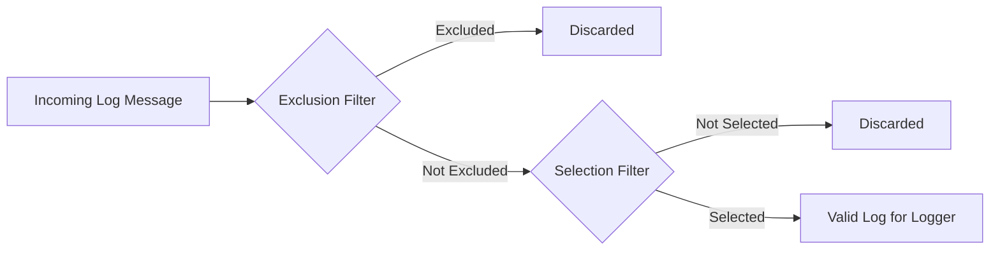

## Category-Based Filtering in iCo3_Logger

iCo3_Logger provides fine-grained control over log visibility through a powerful category-based filtering system. Each log message is defined by a **category** and a **level**, and loggers can filter which messages they process using **inclusion (selection)** and **exclusion** rules.

---

### Concept

The filtering system processes log messages in **two stages**:

1. **Exclusion Filters**: First, excluded logs are discarded.
2. **Inclusion (Selection) Filters**: Then, selected logs are retained.

Only logs that pass both stages are processed.



---

### Setting Filters

Use the `Log.setCategories(...)` command to define filter rules. A single line configures both exclusion and selection.

#### Syntax:
- `<clear>`: Clears all previous filters.
- **Selection**: `category(level)` or just `category` (implies lowest level).
- **Exclusion**: `-category(level)` or just `-category` (excludes all levels).

> Special Categories:
> - `all`: Matches all log messages.
> - `none`: Matches logs without a category (e.g., `Log.info('', 'Message')`).

---

### Examples

#### Filter logs from category `network` with level ≥ `error`:
```dart
Log.setCategories("<clear> network(error)");
```

#### Include all logs except:
- Logs from `ui`
- Logs from `network` if level ≤ `critical`
```dart
Log.setCategories("<clear> all, -ui, -network(warning)");
```

#### Include only `network` logs at level `warning`:
```dart
Log.setCategories("<clear> network(warning), -network(-warning)");
```

---

---
#### Category Filtering Made Simple

The idea is straightforward:
- Want **only** certain categories? Just list them.
- Want to **exclude** some? Start with `all` and remove them.

Examples:
```dart
Log.setCategories("<clear> network, core(warning)");       // Only those
Log.setCategories("<clear> all, -ui, -core");              // Everything except those
```

### Level Table Summary

| Type          | Exclusion (max)     | Selection (min)     |
|---------------|----------------------|-----------------------|
| Normal level  | `level ≤ specified`  | `level ≥ specified`   |
| Inverse level | `level ≥ specified`  | `level ≤ specified`   |

Use inverse by adding `-` before the level inside parentheses.


> **Advanced Usage: Negative Levels**
>
> In most cases, you'll want to **filter logs by setting a minimum level** (e.g., show `warning` and above).  
> However, **negative levels** offer the opposite: they allow filtering **only low-level logs**, like `debug` or `info`.
>
> This is useful when debugging or profiling a specific component, without being overwhelmed by higher-level messages.
>
> **Example:**
>
> ```dart
> Log.setCategories("<clear> network(-debug)");
> ```
>
> ➜ This will capture only `debug` (and lower, like `info`) logs from the `network` category.  
> Ideal for deep investigation of one part of your system.
>
> 🛑 **Caution**: avoid using this in production, as it may generate a large amount of log data.

---

#### Retrieving Active Log Categories

You can retrieve the list of active **category filters** (both selections and exclusions) for a specific logger using:

```dart
List<String> categories = Log.getAllCategories(logger: 'Main');
```

This function returns the list of all currently applied **category rules** used by the logger, including:
- ✅ **Selections** — categories that are allowed.
- ❌ **Exclusions** — categories that are ignored.

By default, it uses the `'Main'` logger, but you can specify another logger if needed.

This is useful to inspect or debug the logger’s filtering behavior at runtime.

---

### Default Configuration

When a logger is created (e.g., `Main`), it is automatically configured as:
```dart
Log.setCategories("all");
Log.enableConsole(true);
```
It will display all logs without requiring any setup.

---

This system provides robust, scriptable filtering tailored to development and debugging workflows in real-world projects.

