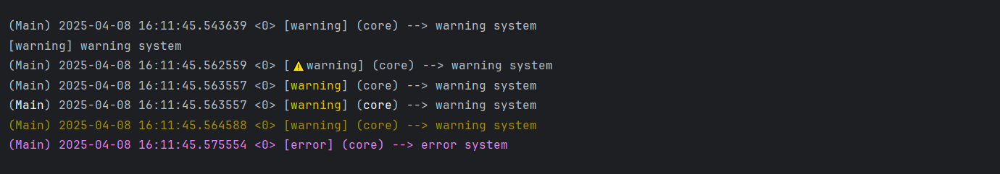
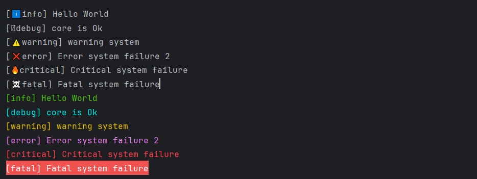

## Console Output

The console output is the most immediate and visual way to observe your logs. You can configure it extensively to suit your development or debugging style.

---

### Enabling Console Output

```dart
Log.enableConsoleOutput();
```

This enables the console output for the default logger (`'Main'`).

To enable console output **exclusively**, deactivating all other outputs:

```dart
Log.enableConsoleOutput(exclusive: true);
```

---

### Disabling Console Output

```dart
Log.disableConsoleOutput();
```

This shuts down only the console output, closing its associated stream.

---

### Customizing Console Appearance

Use `Log.setDecoration()` to personalize how log messages appear in the console:

```dart
Log.setDecoration(
  timeStamp: true,
  timeLine: true,
  loggerID: true,
  category: true,
  mode: 'emoji',
  colorPanel: 'standard'
);
```

#### Options:

- `timeStamp`: shows the timestamp of the log.
- `timeLine`: adds timeline information.
- `loggerID`: displays the logger's identifier (name).
- `category`: prints the category of the log.
- `mode`: affects how logs are visually formatted.

#### Display Modes

| Mode     | Description                                    |
|----------|------------------------------------------------|
| `none`   | Default plain style                            |
| `emoji`  | Adds emojis for each level                     |
| `level`  | Only the level is colorized                    |
| `simple` | Like `level`, but highlights logger & category |
| `full`   | Complete message is colorized                  |

#### Color Panels

| Panel     | Description                             |
|-----------|-----------------------------------------|
| `none`    | No color                                 |
| `standard`| Light theme colors per level            |
| `dark`    | Stronger colors for dark terminals      |

You can also define a **custom panel** using ANSI escape codes:

```dart
Log.setDecoration(mode: 'full', colorPanel: '''{
  "levelColors": {
    "info": "\u001B[97m",
    "debug": "dark",
    "warning": "standard",
    "error": "dark",
    "critical": "standard",
    "fatal": "whiteOnBlue"
  }
}''');
```

---

### Console Output – Made Simple

You can fully customize how your logs appear in the console. But you don’t have to — here are simple presets that cover most needs:

```dart
Log.setDecoration();  
// Default: normal log display (no colors or extra info)

Log.setDecoration(
  timeStamp: false,
  timeLine: false,
  loggerID: false,
  category: false
);
// Minimal: message only, no prefix or details

Log.setDecoration(mode: 'emoji');
// Adds emoji per log level (ℹ️, ⚠️, 🔥...) – colorPanel is optional

Log.setDecoration(mode: 'level', colorPanel: 'dark');
// Highlights only the log level using high-contrast colors

Log.setDecoration(mode: 'simple', colorPanel: 'dark');
// Same as above + logger and category in bold

Log.setDecoration(mode: 'full', colorPanel: 'standard');
// Colors the entire line based on log level

Log.setDecoration(mode: 'full', colorPanel: '''{ "levelColors": {
  "info":"\\u001B[97m",
  "debug":"dark",
  "warning":"standard",
  "error":"dark",
  "critical":"standard",
  "fatal":"whiteOnBlue"
}}''');
// Custom: define your own colors per level (ANSI or presets)
```

**console out example**


**minimum console out example**


➡️ Start simple, and customize only if needed. It’s all optional.

---


#### Predefined ANSI Colors

You can use predefined color names such as:

`red`, `green`, `yellow`, `cyan`, `magenta`, `whiteOnRed`, etc.

#### Default Color Maps

**Standard:**
```dart
{
  info: "green",
  debug: "cyan",
  warning: "yellow",
  error: "magenta",
  critical: "red",
  fatal: "whiteOnRed"
}
```

**Dark:**
```dart
{
  info: "greenLight",
  debug: "cyanLight",
  warning: "yellowLight",
  error: "magentaLight",
  critical: "redLight",
  fatal: "whiteOnRed"
}
```

---

### Emojis by Log Level

| Level     | Emoji     |
|-----------|-----------|
| `info`    | ℹ️        |
| `debug`   | 🪲        |
| `warning` | ⚠️        |
| `error`   | ❌        |
| `critical`| 🔥        |
| `fatal`   | ☠️        |

---

### ANSI Color Reference

iCo3_Logger provides built-in color names for convenience when defining custom `colorPanel`.

#### Predefined ANSI Colors

```text
black:         \x1B[30m  
red:           \x1B[31m  
green:         \x1B[32m  
yellow:        \x1B[33m  
blue:          \x1B[34m  
magenta:       \x1B[35m  
cyan:          \x1B[36m  
white:         \x1B[37m  
grey:          \x1B[90m  
redLight:      \x1B[91m  
greenLight:    \x1B[92m  
yellowLight:   \x1B[93m  
blueLight:     \x1B[94m  
magentaLight:  \x1B[95m  
cyanLight:     \x1B[96m  
whiteAccent:   \x1B[97m
whiteOnBlack:  \x1B[97;40m  
whiteOnRed:    \x1B[97;41m  
whiteOnGreen:  \x1B[97;42m  
whiteOnYellow: \x1B[97;43m  
whiteOnBlue:   \x1B[97;44m  
whiteOnMagenta:\x1B[97;45m  
whiteOnCyan:   \x1B[97;46m  
```

