# 📡 LogProbeService – Scoped Log Capture for ICO3Logger

`LogProbeService` is a plug-and-play service in the `ico3_logger` system. It acts like a **software logic analyzer**, capturing a window of logs **before and after** a defined trigger condition is met. This is ideal for debugging rare or complex behaviors without drowning in unnecessary data.

---

## 🔁 Flow Overview

```mermaid
graph LR
    AA[Incoming Log Message] --> BA[Category-Based Filtering]
    BA --> X
    X[LogProbe service] --> A[Log Message]
    A[Log Message] --> B1[Console Output ✅]
    A --> B2[File Output ❌]
    A --> B3[Memory Storage ❌]
    A --> B4[Process Callback ✅]
```



Logs are filtered by the logger, then passed to `LogProbeService`. If the service is active, matching logs are forwarded to outputs (console, callbacks, etc.).

---

## 🔧 How It Works

`LogProbeService` uses two circular buffers:

- **Pre-buffer**: collects logs *before* a trigger.
- **Post-buffer**: collects logs *after* a trigger.

When a trigger condition is matched, the probe freezes the pre-buffer, starts the post-buffer, and optionally repeats the process a number of times.

Each capture is called an **acquisition** and is identified using `%<probeName>-<index>`.

---

## 🧩 Quick Setup

### 1. Create a Probe Controller

This defines the trigger condition.

```dart
var probeController = LogProbeController(
  level: LogLevel.critical,
  category: 'testLog',
  message: 'log F',
);
```

### 2. Install the LogProbe Service

**Basic usage**:

```dart
Log.installService(
  service: LogProbeService(
    probeName: 'testA',
    probeController: probeController,
    preSize: 10,
    postSize: 5,
    repeat: 2,
    triggerCount: 1,
  ),
);
```

**Advanced setup with callbacks**:

```dart
Log.installService(
  service: LogProbeService(
    probeName: 'testA',
    onAcquisitionComplete: (id) =>
        LogPrint.print('onAcquisitionComplete $id'),
    onTriggerValidation: (id, msg) {
      LogPrint.print('onTriggerValidation $id');
      return true;
    },
    onEndRepeat: (id) => LogPrint.print('onEndRepeat $id'),
    probeController: probeController,
    preSize: 10,
    postSize: 5,
    repeat: 2,
    triggerCount: 1,
  ),
);
```

---

## 🎛️ Runtime Control via `probeController`

Once installed, you can dynamically control the probe:

### 🔹 Manually trigger the capture

```dart
probeController.forceTrigger(message: 'do trigger manually');
```

### 🔹 Stop or restart the probe

```dart
probeController.stopProbe(clear: false); // Stop, keep buffers
probeController.startProbe();            // Restart with same config
```

### 🔹 Restart with new settings

```dart
probeController.restartProbe(
  preSize: 12,
  postSize: 5,
  repeat: 1,
  triggerCount: 1,
);
```

### 🔹 Update trigger condition on the fly

```dart
probeController.setup(
  message: 'log A',
  category: 'core',
  environment: 'proxy',
  level: LogLevel.error,
);
```

---

## 📞 Lifecycle Callbacks

You can respond to key probe events with optional callbacks:

### ✅ `onTriggerValidation`

Decides whether to continue with the acquisition.

```dart
onTriggerValidation: (id, message) {
  return message.message.contains("ERROR"); // accept only error logs
}
```

### ✅ `onAcquisitionComplete`

Called after post-buffer capture is complete.

```dart
onAcquisitionComplete: (id) {
  print("Acquisition completed for $id");
}
```

### ✅ `onEndRepeat`

Called after all configured repeats have finished.

```dart
onEndRepeat: (id) {
  print("Final repetition complete for $id");
}
```

---

## 📌 Notes

- All logs are filtered **before** reaching the probe.
- Outputs (console, callback, etc.) are triggered **only** for active acquisitions.
- `LogProbeService` can be reused across multiple acquisitions.

---

