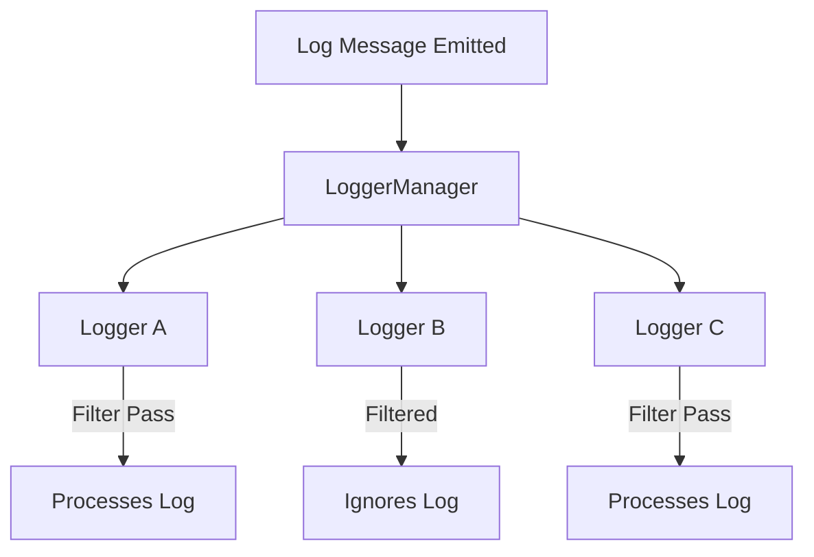

## Multi-Logger Support in iCo3_Logger

Unlike traditional logging systems where logs are pushed into a predefined logger instance, **iCo3_Logger features a centralized `LoggerManager`** that dispatches every log to **all available loggers**.

Each logger decides **independently** whether to process or ignore a log, based on its own filtering rules.

This design allows multiple outputs (console, files, memory, network, etc.) to coexist and react in parallel, making the system both **modular** and **scalable**.

---

### How it works



- The log is **presented to all loggers**.
- Each logger evaluates the log via category filters.
- If accepted, it processes the message (output, transformation, callback, etc).

---

### Logger Creation

To create a new logger, use:

```dart
static LogError createLogger(String logId, {
  String? categories,
  bool enableConsoleOutput = true
});
```

#### Parameters:
- `logId`: Unique name of the logger.
- `categories` *(optional)*: A category string (e.g., `"<clear> core(warning), network"`).
- `enableConsoleOutput`: Whether the logger should output to console (default: `true`).

---

### Contextual Loggers with `closeLogger`

iCo3_Logger supports **contextual loggers**: create them only when needed and **dispose them cleanly** afterward.

This makes it easy to:
- Add temporary log sinks (for debugging or per-module logging)
- Isolate specific tasks or scopes
- Reduce overhead when not in use

#### Example:
```dart
Log.createLogger('TaskLogger', categories: 'task(critical)', enableConsoleOutput: false);
...
Log.critical('task', 'a critical issue occurred in task X');
Log.closeLogger(logger: 'TaskLogger');
```

You can close any previously created logger by:

```dart
Log.closeLogger(logger: 'LoggerName');
```

And to stop all remaining loggers at shutdown:

```dart
Log.stopLoggers();
```

---

### Full Example

```dart
import 'package:ico3_logger/ico3_logger.dart';

void main() {
  Log.setCategories('<clear> network(warning), process, core(critical)');

  Log.createLogger('LogTech', categories: '<clear> core');
  Log.createLogger('ATech', categories: '<clear> core', enableConsoleOutput: false);

  Log.enableProcessOutput(logger: 'ATech', exclusive: true, onLogMessage: (log) {
    LogIO.print('ATech ==> $log');
  });

  Log.fatal('network', 'test fatal network V2');
  Log.critical('core', 'test critical core V2');
  Log.info('core', 'test info core V2');

  Log.closeLogger(logger: 'ATech');

  Log.fatal('network', 'test fatal network V2');
  Log.critical('core', 'test critical core V2');
  Log.info('core', 'test info core V2');

  Log.closeLogger(logger: 'LogTech');

  Log.fatal('network', 'test fatal network V2');
  Log.critical('core', 'test critical core V2');
  Log.info('core', 'test info core V2');

  Log.stopLoggers(); // Optional final cleanup
}
```

---

### Output

```
(Main) 2025-04-09 00:16:26.656439 <0> [fatal] (network) --> test fatal network V2
(Main) 2025-04-09 00:16:26.674391 <0> [critical] (core) --> test critical core V2
(LogTech) 2025-04-09 00:16:26.674391 <0> [critical] (core) --> test critical core V2
ATech ==> 2025-04-09T00:16:26.674391 <0> [critical] (core)  --> test critical core V2 
...
```
---

> ⚠️ **Custom loggers are not supported (yet)**
>
> iCo3_Logger has a high-performance internal system based on concurrent log dispatching and structured filtering.
> While it is technically possible to create custom loggers by interacting with the core system, this feature is **not officially supported**.
>
> Implementing a logger requires a deep understanding of iCo3_Logger's internals, including thread safety, filtering logic, and lifecycle management.
>
> If you choose to experiment, **you do so at your own risk**.  
> We do not currently provide documentation or support for custom logger implementations.
>
> Safer alternatives:
> - Use `enableProcessOutput(...)` for custom stream handling
> - Log to memory or file with built-in methods
>
> This decision may evolve depending on real-world needs.

---
