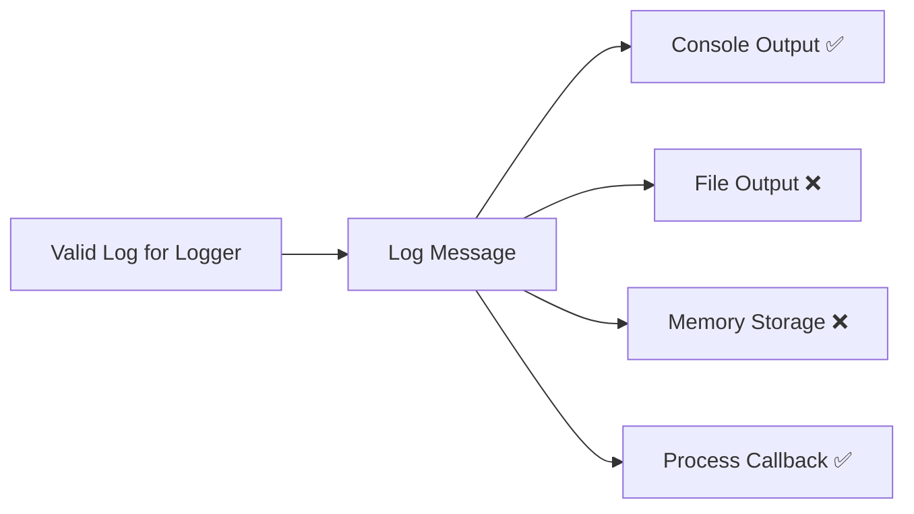

## Output System – General Overview

`iCo3_Logger` provides a flexible and powerful output system designed for multi-channel logging.  
You can activate one or several outputs at the same time, or choose to work exclusively with just one.

### Available Outputs

- **Console**  
  Displays logs in the terminal with optional decorations (emoji, levels, colors...).

- **File**  
  Saves logs to local files for persistence or later analysis.

- **Memory (Storage)**  
  Keeps logs in memory (in a message list), which can later be exported or inspected.

- **Process**  
  Sends logs to a user-defined callback for custom processing (e.g. forward to a server, trigger alerts...).

---

### Controlling Output Activation

Each output can be enabled or disabled individually:

```dart
Log.enableConsoleOutput();     // Activates console logging
Log.disableConsoleOutput();    // Deactivates console logging
```

To **disable all outputs**:

```dart
Log.disableAllOutputs();
```

To **enable only one output** and disable all others in one command:

```dart
Log.enableConsoleOutput(exclusive: true);
```

---

### Getting Active Outputs

You can retrieve the list of currently active outputs:

```dart
List<String> active = Log.getOutputsEnabled();
```

---

### Output Activation Diagram



---

### Summary of Output Commands

| Output Type | Enable Command             | Disable Command              |
|-------------|----------------------------|-------------------------------|
| Console     | `enableConsoleOutput()`     | `disableConsoleOutput()`      |
| File        | `enableFileOutput(...)`     | `disableFileOutput()`         |
| Storage     | `enableStorageOutput()`     | `disableStorageOutput()`      |
| Process     | `enableProcessOutput(...)`  | `disableProcessOutput()`      |
| All         | —                          | `disableAllOutputs()`         |

> ⚠️ `enableFileOutput(...)` and `enableProcessOutput(...)` may require additional parameters.

---

You can now explore each output in more detail in their dedicated pages:
- [Console Output](consoleOutput.md#console-output)
- [File Output](fileOutput.md#file-output)
- [Process Output](processOutput.md#process-output)
- [Storage Output](storageOutput.md#storage-mode)
