# Log Services

A **Log Service** is an independent component that is inserted between **log selection** (category filtering) and **log output**.  
It acts as an application within the logging pipeline: it can **modify**, **store**, **suppress**, or **generate** log messages before they're forwarded to their final outputs.

Both the **logger** and the **outputs** remain active — the service acts as an optional middle layer with full control over the message flow.

---

## Diagram – Where the Service Fits

```mermaid
graph LR
    AA[Incoming Log Message] --> BA[Category-Based Filtering]
    BA --> X
    X[Service Logger] --> A[Log Message]
    A[Log Message] --> B1[Console Output ✅]
    A --> B2[File Output ❌]
    A --> B3[Memory Storage ❌]
    A --> B4[Process Callback ✅]
```



---

## How to Create a Log Service

To implement a service, create your own class by extending the abstract base class `LogService`:

📄 [`lib/src/service/log_service.dart`](../lib/src/service/log_service.dart)

```dart
abstract class LogService {
  LoggerBase? masterLogger;

  LogError installLogger(LoggerBase logger) {
    masterLogger = logger;
    return LogError(0);
  }

  LogError receiveLog(LogMessage message);

  LogError outLog(LogMessage message) {
    return masterLogger?.postProcessLogMessage(message)
        ?? LogError(-1, message: "masterLogger doesn't exist");
  }

  LogError startService() => LogError(0);
  LogError stopService() => LogError(0);
}
```

### Method Summary

| Method              | Purpose                                                                 |
|---------------------|-------------------------------------------------------------------------|
| `installLogger`     | Assigns the logger instance used by the service.                        |
| `receiveLog`        | Called when a log message is sent to the service.                       |
| `outLog`            | Sends a log message from the service back to the logger for output.     |
| `startService`      | Optional lifecycle method (e.g., for resources or setup).               |
| `stopService`       | Optional lifecycle method (e.g., for cleanup).                          |

---

### 🧱 Minimal Service Example

If you need a simple forwarding service that performs **no transformation or filtering**, you can start with the following minimal implementation:

```dart
/// A minimal LogService that directly forwards all received logs
/// to the logger's output without any processing.
class LogServiceMinimal extends LogService {
  @override
  LogError receiveLog(LogMessage message) => outLog(message);
}
```

This class is useful as:
- A **template** for creating your own services.
- A **default** pass-through when no additional logic is required.
- A **debug tool** to validate the log processing flow.

To install it on a logger:

```dart
Log.installService(service: LogServiceMinimal());
```

This service maintains full compatibility with the logger's output configuration and allows you to extend it progressively with your own logic.

## Built-in Examples

- 🔧 [`PostFatal Service`](../lib/src/service/postFatal_service.dart) – Trigger logic after a fatal event.
- 🩺 [`Sniffer Service`](../lib/src/service/snifferLog_service.dart) – Inspect and analyze live log streams.

---

## Alternative: Process Output Callback

You can also intercept log messages using a callback function via the **process output mode**:

```dart
Log.enableProcessOutput(
  exclusive: true,
  onLogMessage: (log) {
    print('-->> $log');
  }
);
```

---

## Choosing Between Service and Callback

| Feature                  | Process Callback       | Log Service                    |
|--------------------------|------------------------|--------------------------------|
| Lightweight handler      | ✅                     | ⚠️ Slightly heavier             |
| Output control reuse     | ❌                     | ✅ Full access to logger output |
| Stays in log thread      | ❌                     | ✅                              |
| Modular/custom behavior  | ⚠️ Limited             | ✅                              |

You can also combine both approaches on the same logger if needed.


```
